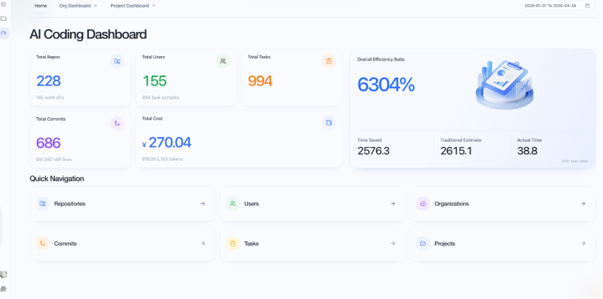

# CoStrict Change Log

> For the complete history, please visit [CHANGELOG_ARCHIVE.md](./CHANGELOG_ARCHIVE.md)

## [3.0.13]

- Optimize CoStrict Cloud
- Fix known issues

## [3.0.12]

- Clean up branding and descriptions
- Fix slash command context detection
- Add `forcePreserveReasoning` option for preserving empty reasoning content in transform
- Expand GBK command list for MSVC/.NET toolchains, strip BOM in saveDirectly
- Optimize prompt
- update docs
- Fix known issues

## [3.0.11]

- Enhance form state persistence by excluding React controlled elements (#1325)
- Add cloud UI switch confirmation dialog and fix scroll event propagation (#1324)
- Add fallback to classic mode on crash screen for assistant UI (#1323)
- Add support for GPT-5.5 model (#1322)
- Fix known issues

## [3.0.10]

[CoStrict Cloud](https://zgsm.sangfor.com/cloud/workspace) is an AI-powered cloud programming workspace that lets you remotely connect to your personal devices (local or private servers) from any browser. It features conversational AI programming, project file management, multi-session persistence, and remote terminal collaboration — enabling seamless browser-based remote development, real-time AI coding and debugging, and cross-device project continuity.

## [2.8.15]

- Enhance CoStrict code mode handling and improve error logging (#1310)
- Update IPC connection retry logic and improve session ID generation (#1309)
- Pin `@types/node-ipc` version (#1308)
- Add Qwen3 model support, lazy MCP initialization, and improve parser robustness (#1306)
- Update SSH deployment process to use private key and correct directory paths (#1299)
